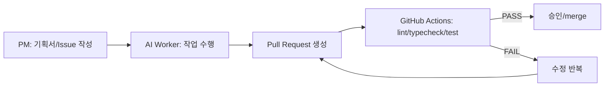

# Dev Factory (Executive One-Pager)

## 한 줄 요약
기획자는 "지시"만 하고, 코딩/PR/테스트는 자동화된 AI 작업자가 수행하며, 품질은 PR 게이트로 통제합니다.

## 입력/처리/통제/산출물
- 입력: `project_description.md`(방향/범위), GitHub Issues(작업 지시)
- 처리: AI Worker가 코드/문서 변경을 만들고 Pull Request(PR) 생성
- 통제: GitHub Actions가 `lint/typecheck/test`를 자동 실행, 실패 시 merge 차단
- 산출물: PR(변경 이력/검증 증거/리뷰 기록)

## MVP에서 지금 되는 것(서버 0)
- GitHub Actions에서 AI Worker 실행(서버 운영 없이)
- Issue를 읽고 PR 생성(현재는 plan-only부터 시작 가능)
- PR에서 자동 테스트가 돌아가고, 통과해야 merge 가능

## 확장 시나리오(온프렘 연결)
- on-prem k8s/사내망 접근이 필요해지면 self-hosted runner 추가
- PR별 시험장 배포 + 통합 테스트(Karate/Supertest)로 "merge=배포 준비 완료" 수준까지 강화

---

## 이미지 1: 업무 흐름(Flow)



## 이미지 2: 구성 요소(Architecture)

```mermaid
flowchart TB
  PM[공장 관리자(PM)]
  R[Ruler: 규칙/표준]
  GH[(GitHub Repo)]
  AI[AI Worker (GitHub Actions)]
  CI[CI Gate: lint/typecheck/test]
  PR[PR/Review]
  EXT[온프렘 확장: self-hosted runner + k8s 시험장 + 통합테스트]

  PM -->|지시| GH
  R -->|규칙| AI
  GH --> AI
  AI --> PR
  PR --> CI
  CI -->|PASS| PR
  CI -->|확장| EXT
```

---

## (선택) 이미지 생성용 프롬프트 2개

### Prompt 1 (Flow diagram)
"A clean enterprise infographic, Korean labels, showing a simple left-to-right workflow: PM writes plan/issue -> AI worker creates PR -> CI runs lint/typecheck/test -> if pass then merge, if fail then loop back to PR updates. Minimal icons, white background, navy/gray palette, high readability, 16:9."

### Prompt 2 (Architecture diagram)
"A clean system architecture diagram, Korean labels, showing components: PM, Ruler(standards), GitHub Repo, AI Worker running on GitHub Actions, CI gate (lint/typecheck/test), PR/Review, and optional extension to on-prem (self-hosted runner + Kubernetes staging + integration tests). Minimal modern style, white background, navy/gray, 16:9."
